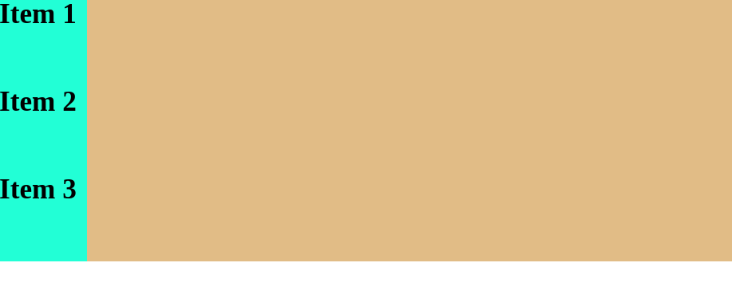

# Flexbox

O flexbox é uma propriedade do CSS que permite transformar um elemento em um contêiner flexível, possuindo diversas propriedades para manipulação dos elementos de dentro desse contêiner, permitindo ajustar o alinhamento, espaçamento entre itens, entre outras funcionalidades.
## Display flex

Para definir um elemento como um contêiner flex basta colocar a propriedade `display: flex` no elemento.

## Flex-direction

A propriedade `flex-direction` permite definir a direção do eixo principal (*main-axis*). O valor padrão dessa propriedade é `row`, que deixa todos os elementos do contêiner na mesma linha. Além do `row`, um outro valor possível é `column`, que deixa cada elemento embaixo do outro.

Exemplo com `flex-direction: row`:
```css
* {
	margin: 0;
	padding: 0;
	box-sizing: border-box;
}

.flex-container {
	display: flex;
	background-color: burlywood;
	flex-direction: row;
}

.flex-item {
	height: 100px;
	width: 100px;
	background-color: aquamarine;
}
```

Resultado:


Exemplo com `flex-direction: column:
```css
* {
	margin: 0;
	padding: 0;
	box-sizing: border-box;
}

.flex-container {
	display: flex;
	background-color: burlywood;
	flex-direction: column;
}

.flex-item {
	height: 100px;
	width: 100px;
	background-color: aquamarine;
}
```

Resultado:
